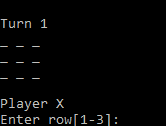
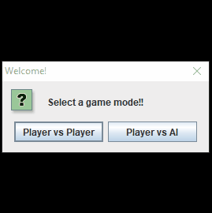

# Tic-Tac-Toe

Here is Tic-Tac-Toe playable through terminal/CLI or graphical user interface! Play against local player vs player or player vs AI! 

The artificial intelligence used in player vs AI mode was possible through the [minimax algorithm](https://en.wikipedia.org/wiki/Minimax) which performs decision making. In this version of the AI, the use of minimax with [alpha-beta pruning](https://en.wikipedia.org/wiki/Alpha%E2%80%93beta_pruning) allows for more strategic and quicker decision making! The full potential of the AI is available in hard mode where your best plays will likely lead you to a draw at the very most. Normal mode dumbs down the AI by utilizing a "rationality rate", or in other words, a defined percentage of time the AI will make an optimal move!

      

Running local player vs player in the CLI version:
```
java TTTDemo CLI
```

Running player vs AI in the CLI version!
```
java TTTDemo CLI normal

or

java TTTIDemo CLI hard
```

Running the GUI version (includes both modes):
```
java TTTDemo GUI
```
